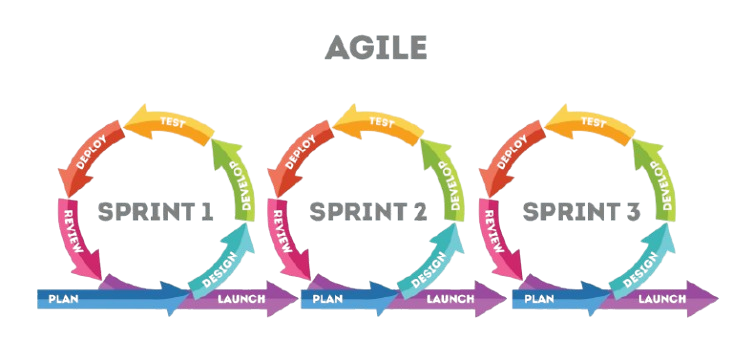
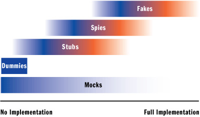
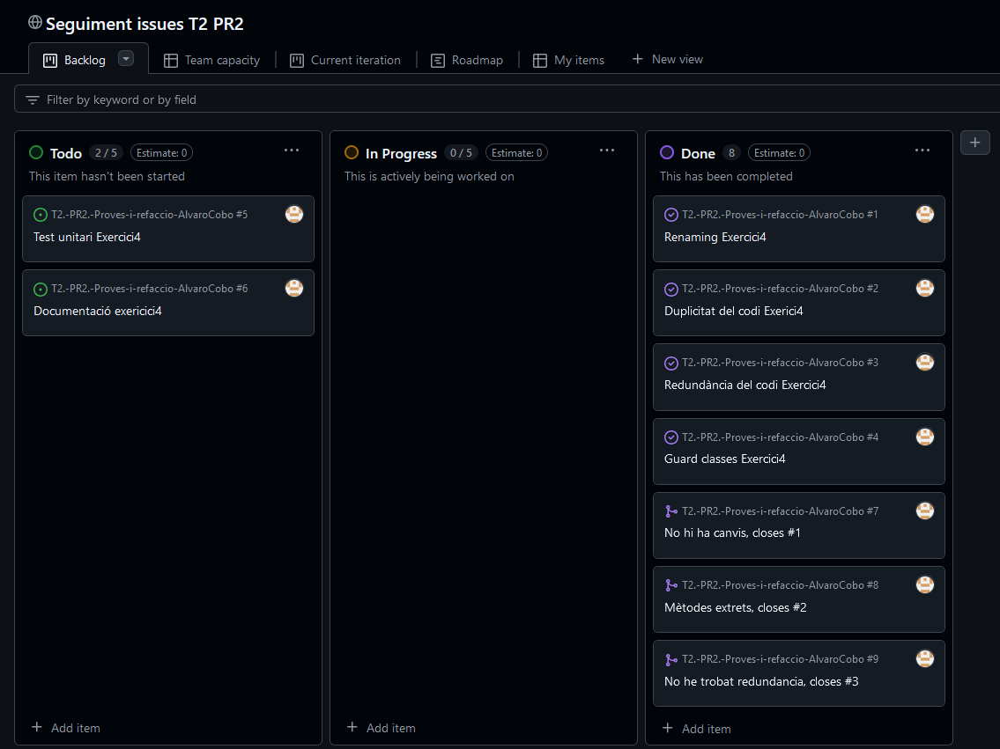

# Exercicis T2. PR2. Proves i refacció

### Exercici 1. Quines són les característiques i els escenaris d'ús de les metodologies àgils de desenvolupament de programari? Explica amb detall i posa un exemple
La metodologia àgil (o en anglès, _Agile_) és una metodologia que busca entregar al client petites parts de software funcional,
en comptes de lliurar un producte complet al final del projecte. La metodologia àgil és una metodologia **iterativa**, 
que trenca els projectes en diferents parts anomenades _sprints_. 

Un **sprint** és un període de temps fix, normalment entre 1 i 4 setmanes. L'equip segueix un estructurat que inclou diferents
fases, per assegurar que s'entreguin funcionalitats de valor al final de cada sprint. Tot aquesta informació es guarda al _backlog_
del projecte, un document on es recopilen totes les tasques a fer i la seva duració.



Després de cada sprint, els equips fan una retrospectiva, per veure si hi ha alguna cosa que podría canviar pels següents sprints. D'aquesta
manera, els clients tenen l’oportunitat de revisar i proporcionar _feedback_ de manera contínua, assegurant-se que el producte
final compleix amb les seves necessitats i expectatives. Això permet ajustar els requisits i prioritats al mateix temps que es produeix, 
**incrementant la flexibilitat i l’eficiència** del projecte.

Aquesta metodologia té diferents _frameworks_, cada un adaptat a diferents necessitats i contextos dins del desenvolupament
de projectes. Per exemple, **Scrum** s'enfoca en l'entrega incremental del producte amb sprints (imatge de sota), mentre
que **Kanban** no té sprints, sinó que s'enfoca en el treball continuu per optimitzar l'entrega sense sobrecarregar els equips.

Posarem l'exemple d'un **marketplace online**. Aquest projecte es podria dividir en els següents sprints:
- **Sprint 1**: Desenvolupament de la funcionalitat de registre per a compradors i venedors
- **Sprint 2**: Creació de pàgines per publicar productes
- **Sprint 3**: Implementació d'un sistema de cerca
- **Sprint 4**: Integració del sistema de pagament
- **Sprint 5**: Afegir sistema de comentaris i puntuacions

### Exercici 2. Què són els dobles de prova? Explica amb detall els diferents tipus i posa un exemple d’ús per a una solució en C#.
Els **dobles de prova** són eines de testing, utilitzades per simular el comportament de mètodes sense haver de
dependre del codi en producció. És a dir, serveixen per verificar el funcionament del sistema sota determinades condicions,
controlant o aïllant parts del codi. Hi ha de diferents tipus:
1. **Dummies**: Són el tipus més bàsic. Només serveixen per complir els requisits del codi (per exemple, invocar una funció
amb un paràmetre), però no tenen cap funcionalitat real.
   - Per exemple, ```valor_dummy = 0``` com a paràmetre d'una funció que no consulta aquest valor.

2. **Stubs**: S'utilitzen per simular el comportament d'un mètode, proporcionant respostes predefinides a diverses
entrades (_hard-coded values_). Els mètodes que no retornen res (_void_) no poden tenir aquesta implementació.
   - Per exemple, substituim una funció que calcula descomptes per una versió simplificada que sempre retorna un 20%.
   
   ```c#
   public static double CalculatePriceWithDiscountStub(int preu){
        return preu * 0.8;
   }
   ```
   
3. **Mocks**: Els mocks no implementen funcionalitat directa, sinó que se centren a comprovar **com es comporta el nostre
codi** quan es produeix un esdeveniment o s'invoca un mètode. Podem controlar la interacció i proveeïr el codi que volem
que s'executi en cada invocació.
   - Per exemple, verifica que ```RegistreUsuari(nomUsuari, idUsuari)``` ha sigut invocat amb els valors correctes.

4. **Spies**: Similar als _stubs_, però els **spies** a més de simular el comportament d'un mètode, també controlaràn
què mètodes han sigut invocats. Amb això, l'Unit Testing pot verificar què els mètodes han sigut invocats com s'espera.

5. **Fakes**:



### Exercici 3. Què és CI/CD? Fes un vídeo explicant les característiques bàsiques, el seu flux de treball i un exemple pràctic d’integració amb GitHub d’una solució en C#.

### Exercici 4. Aplica els patrons de refacció més habituals en el codi que trobaràs en aquest enllaç. Hauràs de:
- **Crear un projecte vinculat al teu repositori de la tasca**
- **Crear una issue per cada tasca que s’hagi de dur a terme per aplicar els diferents patrons**
- **Tancar les tasques mitjançant Visual Studio i les pull requests (PR)**
- **Crear els tests unitaris per a validar el teu codi**
- **Documentar els patrons que has aplicat i els criteris per a executar els casos de prova**


- **Renaming**: Tots els noms de les variables em semblen bé escollits. No he fet canvis.
- **Duplicitat del codi**: Creació de _ClassLibrary_ per extraure mètodes. Extracció a constants dels missatges per consola.
He extret els mètodes que calculen l'àrea i la circumferència, perque podrien ser utilitzats en una altra part del codi.
Estructura del _if-else_ canviat a **switch** en imprimir el rang d'àrea per gust personal.
- **Redundància del codi**: No hi ha variables ni constants sense utilitzar, ni codi comentat. Tampoc hi ha condicions que
poden ser extretes a mètodes. Ja afegiré les condicions al _guard clauses_.
- **Guard clauses**: Había pensat a llençar excepcions, si al calcular qualsevol cosa els valors eres iguals o menors que 0.
Però, he pensat que era molt millor controlar l'entrada de l'usuari i fer una estructura _do-while_ perquè la seva entrada
sempre fossi "> 0". Aixì, les dades que rebren els mètodes sempre són vàlids i no hauràn de calcular una àrea negativa.
He extret al mètode _IsUnderZero_ la condició que el valor que introdueixi l'usuari sigui major que 0.


- **Test unitari**: Usant el tipus de projecte MSTest, he desenvolupat el testing pel meu codi per les 3 de les 4 funcions 
que hi ha a la meva _Class Library_.
  - **IsUnderZero**: Aquest mètode retorna un booleà, depenent de si el valor és menor o igual que 0. He desenvolupat dos
test, un que invoca la funció amb una variable que conté un valor positiu, i un altre test amb valor negatiu.
    ```c#
    [TestMethod]
    public void OverZero() {
    //Arrange
    double value = 32;
    
    //Act
    bool result = MyFunctions.IsUnderZero(value);
    
    //Assert
    Assert.IsFalse(result);
    }
    ```
    He fet el mateix test per un valor negatiu, canviant la variable _value_ i el assert a _Assert.IsTrue_.    

  - **CalculateArea**: El test està fet basat en el fet que la funció m'ha de retornar el resultat esperat. Això el faig
calculant de manera manual el resultat, d'aquesta manera:
    ```c#
    [TestMethod]
    public void CorrectArea() {
    //Arrange
    double width = 5;
    double height = 10;
    double expectedResult = 50;

    //Act
    double result = MyFunctions.CalculateArea(width, height);

    //Assert
    Assert.AreEqual(expectedResult, result); 
    }
    ```
  - **CalculateCircumference**: Igual que amb _CalculateArea_, el test està basat en el fet que m'ha de retornar un valor esperat,
calculant el valor esperat al mateix test, d'aquesta manera:
    ```c#
    [TestMethod]
    public void CorrectCircumference() {
    //Arrange
    double radius = 5;
    double expectedResult = 2 * Math.PI * radius;

    //Act
    double result = MyFunctions.CalculateCircumference(radius);

    //Assert
    Assert.AreEqual(expectedResult, result);
    }
    ```
   
  - **PrintAreaMessage**: Per aquest mètode no he pogut desenvolupar un test, perquè només printa un missatge depenent
de l'àrea passada com a paràmetre.


- Captura de les issues per cada tasca del refactoring, pull requests i el projecte al repositori del GitHub:
  


- Per veure el codi d'aquest exercici, visiteu aquest [link](../Projecte%20VS).


### Exercici 5. Defineix els casos de prova i implements els tests unitaris pel següent problema.  En el mateix projecte que a l’exercici anterior, hauràs de:
- **Crear una issue per la tasca que s’ha de dur a terme per fer les proves**
- **Tancar les tasques mitjançant Visual Studio i les pull requests (PR)**
- **Crear els tests unitaris per a validar la .dll fent servir el framework XUNit**
- **Documentar els criteris per a executar els casos de prova i les incidències detectades (si s’escau)**

### Exercici 6. Què són els analitzadors de codi? Fes un vídeo explicant les característiques principals i mostra la configuració i funcionament de Sonarqube amb una solució teva en C#.

### Exercici 7. Indica les referències que has consultat (pàgines web, llibres, revistes...), seguint el següent format:

#### Pàgines web
- Red Hat (29/07/2022). What is agile methodology? Red Hat. Recuperat el 28/11/2024 de [link a la pàgina](https://www.redhat.com/en/topics/devops/what-is-agile-methodology)
- Sarah Laoyan (02/02/2024). What is Agile methodology? A begginer's guide. Recuperat el 28/11/2024 de [link a la pàgina](https://asana.com/resources/agile-methodology)
- Antonio Leiva (05/01/2023). ¿Qué son los dobles de test?. DevExpert. Recuperat el 30/11/2024 de [link a la pàgina](https://devexpert.io/dobles-test)
- Diversos autors (última edició 09/11/2024). Test double. Wikipedia. Recuperat el 30/11/2024 de [link a la pàgina](https://en.wikipedia.org/wiki/Test_double)
- Red Hat (12/12/2023). What is CI/CD? Red Hat. Recuperat el 28/11/2025 de [link a la pagina](https://www.redhat.com/en/topics/devops/what-is-ci-cd)

#### Articles
- Mark Seemann. (2007). Exploring The Continuum Of Test Doubles. [Link](https://learn.microsoft.com/en-us/archive/msdn-magazine/2007/september/unit-testing-exploring-the-continuum-of-test-doubles)

#### IA
- Dame ejemplos sobre proyectos en los que usar la metodologia agile. Dime ejemplos sueltos, no hace falta que me los describas.

-> Aquí tienes ejemplos de proyectos en los que se podría usar la metodología Agile
  - Desarrollo de una aplicación para seguimiento de hábitos de salud y fitness
    - Creación de una aplicación móvil para entregas a domicilio
    - Desarrollo de un juego móvil con integración multijugador
    - Diseño de un sistema de reservas en línea para un hotel o cadena de restaurantes
    - Desarrollo de un sistema de gestión de inventarios para pequeñas empresas
Estos proyectos son ideales para Agile porque tienen objetivos dinámicos, requieren retroalimentación constante y 
necesitan iteraciones rápidas para adaptarse a las necesidades de los usuarios o clientes.